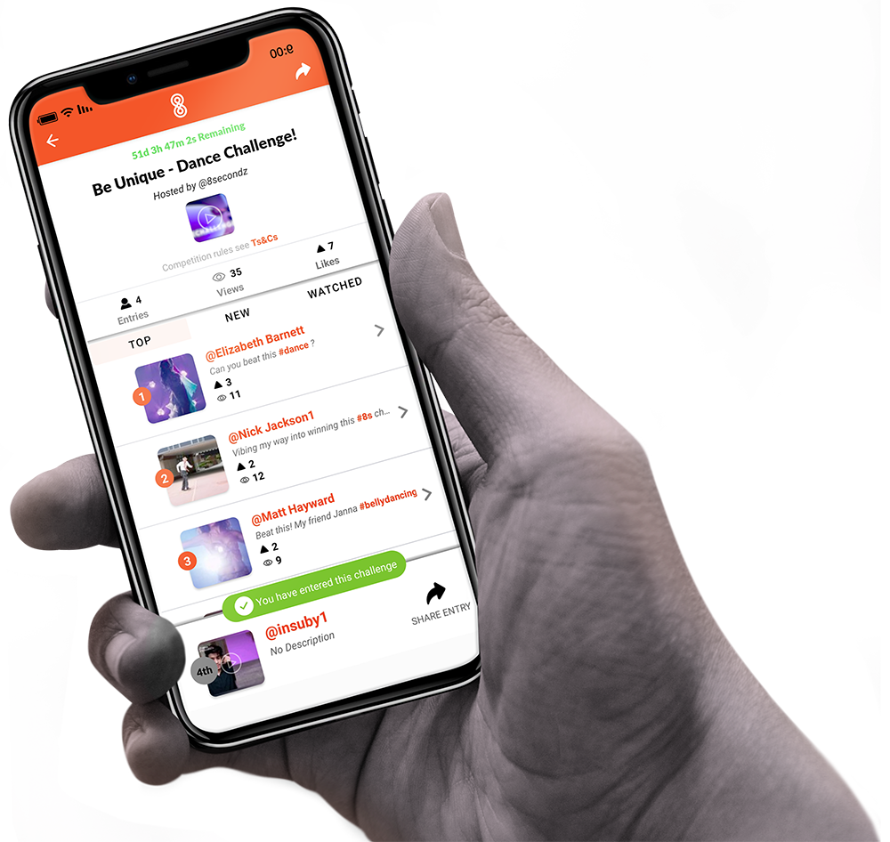

8secondz is an online shortform platform that helps content creators from all around the world to meet a common objective: to beat the internet. 8secondz is a challenge focused app, where you can set up competitions to win prizes.
Basically, you can:
- Upload video on any platform (iOS, Android, Web)
- Create challenges and win in-app prizes
- Participate in sponsored competitions to win real prizes

Role: Software Engineer

- Develop front-end with VueJS
- Developer backend using NodeJS
- Design and implement RDS database using MySQL.
- Design and implement APIs with AWS infrastructures 

Checkout the [website](https://www.8secondz.com)

